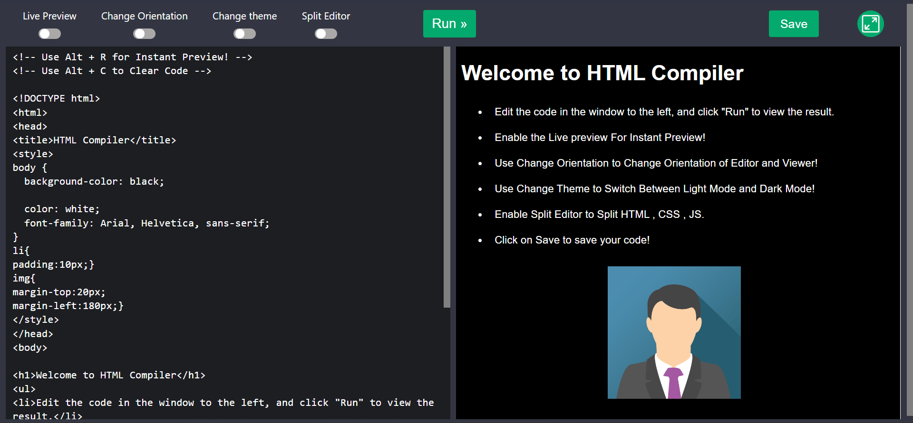

# Online HTML Compiler

## Overview

The Online HTML Compiler is a web application that allows you to write, compile, and preview HTML code in real-time. It comes with several features to enhance the coding experience.

## Features

- **Split Editor:** Divide your coding workspace into multiple sections for efficient coding.
- **Live Preview:** Instantly see the output of your HTML code as you type.
- **Dark Mode:** Toggle between light and dark modes for comfortable coding in any environment.
- **Changing Orientation:** Adjust the layout to suit your coding preferences.
- **Save Code:** Save your work for future reference or continued development.
- **Clean UI:** A user-friendly and clutter-free interface for a seamless coding experience.

## Technologies Used

- HTML
- CSS
- JavaScript

## Screenshots

## Contributing

Contributions and issue reports are welcome.

## Author

**Himavarshith Reddy**
